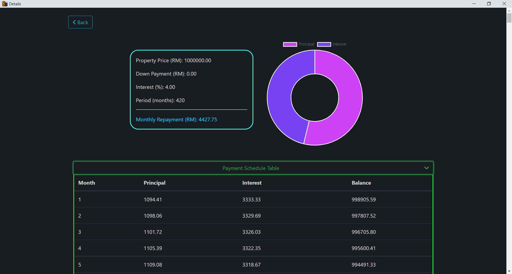

# Home Loan Calculator
This is a home loan calculator that can calculate home loan repayments and provide details like payment breakdown and payment schedule for each calculate result.  
  

  

---
- [Home Loan Calculator](#home-loan-calculator)
  - [Official Website](#official-website)
  - [Intro](#intro)
  - [Requirements](#requirements)
  - [Install](#install)
  - [Usage](#usage)
    - Using the calculator
    - See Result History
    - What you can do at Results (result history) page
    - What you can do at Details (details for a specific result) page
    - Help
    - Dark Mode Support
  - [Languages used](#languages-used)
  - [Libraries and Frameworks used](libraries-and-frameworks-used)

# Official website
Visit the [official website](https://jpro-22.github.io/home-loan-calculator/) of this app! 

# Intro
This is a Malaysia Secondary Form 3 ASK (*Computer Science Basics*) year-end Python project made possible with [Tkinter](https://docs.python.org/3/library/tkinter.html) and [Eel](https://github.com/ChrisKnott/Eel).

Our task is to create a home loan calculator that can:
- Calculate home loan repayment
- Provide the details for every month's repayment

# Operating System
[Windows](https://www.microsoft.com/en-my/windows)

# Requirements
You need to have Chrome installed as this app uses Chrome to show the result history or the details of a specific calculate result. 

# Install
Download and install the app from the [official website](https://jpro-22.github.io/home-loan-calculator). 

# Usage
Launch the app and and you will see the home page coming up.  
  
---
> **Using the calculator**  
>  
> 
>  
> 1. Fill in the loan details. Press enter or click to calculate. 
> 2. The monthly repayment will show up. You can click to see more details like payment breakdown and payment schedule. 
---
> **See Result History**  
>   
> 
> 1. Click "Results" at home page and a loading screen will show up while Chrome is starting. 
> 2. Wait patiently for Chrome to load everytime. 
> 3. In case you rushed things and the app cannot detect it (which cause the home/calculator page to not show up after you closed the Chrome window) and the loading screen ended up there forever, you can click "Something's wrong, relaunch Chrome" to restart Chrome. 
> 4. Avoid clicking "Something's wrong, relaunch Chrome" if everything is working correctly already. 
---
> **What you can do at Results (result history) page**  
> 
> 
> 1. You can see all the (calculate) result history here. 
> 2. The results by default are sorted by date, which means the most recent result history comes first. You can sort by other options as well, e.g. property price, interest rate, period, etc.
> 3. You can delete them by clicking on the rubbish bin icon if you feel like not needing them anymore. To delete multiple records at once, multi-select the records by clicking on them, then click "Delete" at the top left corner. 
> 4. To view the details for each of the result, click on the "external link icon" (the icon next to the rubbish bin icon). 
> 5. You can also search for records as well using the search bar on top. 
---
> **What you can do at Details (details for a specific result) page**
>
> *Upper part*
> 
>  
>  
> *Lower part*
> 
> 1. You can see all the details for a specific result here: 
>     - loan details
>     - payment breakdown in the form of a doughnut chart. 
>     - payment schedule details (repayment details for every month until the loan is cleared) in the form of a: 
>       - table
>       - line chart  
>  
>       *You can export the payment schedule data as CSV for your own use later.*  
>       *At the line chart, you can click "Balance" to toggle its line off to have a more detailed view of "Principal" and "Interest".*
---
> **Help**  
> 
> 
> 1. If you have forgotten how to use the app, you can always come back here to this user manual by clicking on the "See the user manual" button.  
> 2. If you need further help or want to report a problem, you can create a issue [here](https://github.com/jPRO-22/home-loan-calculator/issues) or [contact me via email](mailto:superjackxh@gmail.com). 
---
> **Dark Mode Support**  
>  
>   
>  
> I'm so glad to announce that this app supports dark mode!  
> To turn it on or off, just turn on/off the dark mode switch at home page. 
---  

# Languages used
1. [Python](https://www.python.org/)
2. [HTML](https://en.wikipedia.org/wiki/HTML)
3. [CSS](https://en.wikipedia.org/wiki/CSS)
4. [Javascript](https://en.wikipedia.org/wiki/JavaScript)

# Libraries and Frameworks used
1. [Eel](https://github.com/ChrisKnott/Eel)
2. [Bootstrap](https://getbootstrap.com/)
3. [bootstrap-table](https://bootstrap-table.com/)
4. [bootstrap-dark](https://github.com/ForEvolve/bootstrap-dark)
